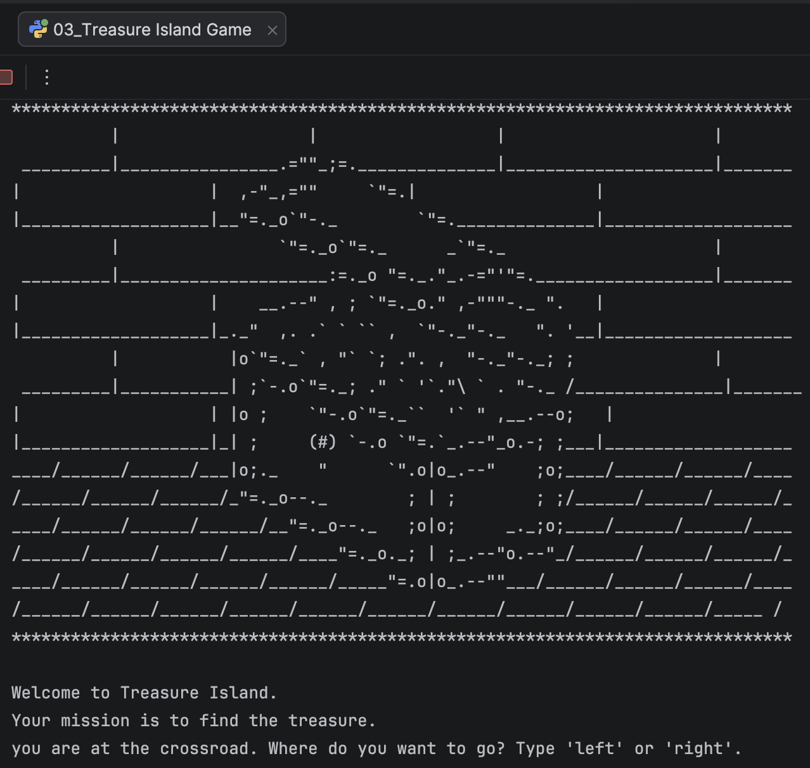

# 🏝️ Treasure Island Game


A simple **text-based adventure game** written in Python.

The player explores Treasure Island by making choices at different stages of the story. Each decision leads to a new outcome, and only the correct path leads to the hidden treasure.

---

## Screenshot

<p align="center">
  
</p>

---

## How the Game Works

The player must make three main decisions:

1. Choose a direction at the crossroad.
2. Decide whether to swim or wait at the lake.
3. Choose one of three coloured doors.

A wrong choice can end the game, while the correct sequence leads to victory.

---

## Flowchart

```text
                    Start
                      │
                      ▼
              Display ASCII Art
                      │
                      ▼
           Choose Left or Right
                ┌─────┴─────┐
                │           │
              Left        Right
                │           │
                ▼           ▼
          Reach Lake     Game Over
                │
                ▼
          Swim or Wait?
           ┌────┴────┐
           │         │
         Wait       Swim
           │         │
           ▼         ▼
      Reach Castle  Game Over
           │
           ▼
     Choose a Door
     ┌─────┼─────┐
     │     │     │
    Red  Green  Blue
     │     │     │
     ▼     ▼     ▼
 Win/Loose Win Win/Loose
```

---

## Project Structure

```text
Treasure-Island-Game/
│
├── 03_Treasure Island Game.py
├── Untitled.png
└── README.md
```

---

## How to Run

```bash
python "03_Treasure Island Game.py"
```

---

## Example

```text
Welcome to Treasure Island.
Your mission is to find the treasure.

You are at the crossroad.
Where do you want to go?
Type 'left' or 'right':
```

---

## Concepts Practised

- User input
- Conditional statements
- `if`, `else`
- String methods
- `.lower()`
- Nested decision logic
- Text-based game design
- Program flow
- ASCII art
