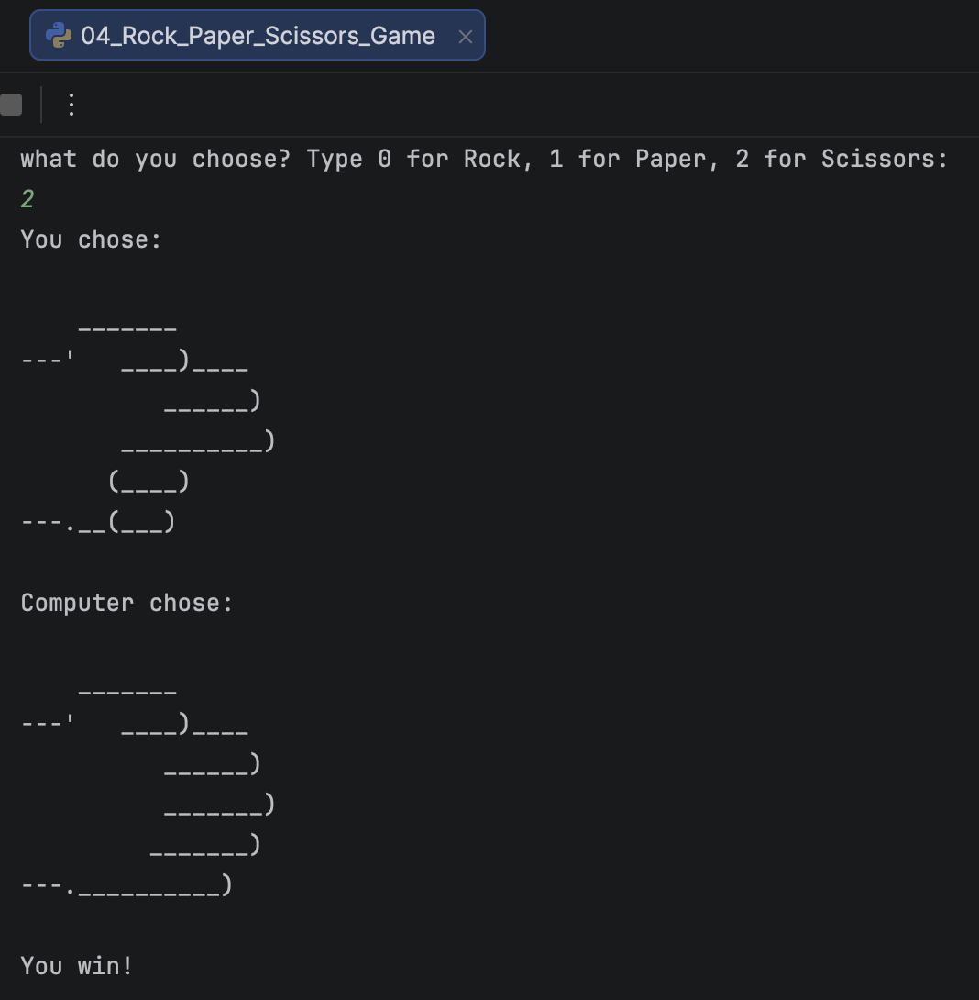

# ✂️ Rock Paper Scissors


A simple command-line implementation of the classic **Rock, Paper, Scissors** game written in Python.

The player selects Rock, Paper, or Scissors, while the computer randomly chooses its move. Both choices are displayed using ASCII art before the game determines the winner.

---

## Screenshot

<p align="center">
  
</p>

---

## Features

- 🎮 Classic Rock, Paper, Scissors gameplay
- 🤖 Random computer opponent
- 🎨 ASCII art for each choice
- ✅ Win, lose, and draw detection
- ⚠️ Input validation for invalid choices
- 🖥 Simple command-line interface

---

## Game Rules

```text
Rock     beats Scissors
Scissors beats Paper
Paper    beats Rock
```

---

## Flowchart

```text
                    Start
                      │
                      ▼
          Display Input Prompt
                      │
                      ▼
          Player Chooses (0–2)
                      │
                      ▼
      Generate Random Computer Choice
                      │
                      ▼
      Display Both ASCII Images
                      │
                      ▼
            Compare Choices
         ┌─────────┼─────────┐
         │         │         │
         ▼         ▼         ▼
       Win       Draw      Lose
         │         │         │
         └─────────┴─────────┘
                   │
                   ▼
                  End
```

---

## Project Structure

```text
Rock-Paper-Scissors/
│
├── 04_Rock_Paper_Scissors_Game.py
├── rock_paper_scissors.png
└── README.md
```

---

## How to Run

Run the program:

```bash
python 04_Rock_Paper_Scissors_Game.py
```

---

## Example

```text
What do you choose?

Type:
0 = Rock
1 = Paper
2 = Scissors

2

You chose:

Scissors

Computer chose:

Paper

You win!
```

---

## Concepts Practised

- Variables
- Lists
- Random module
- User input
- Conditional statements (`if`, `elif`, `else`)
- Comparison operators
- Indexing
- ASCII art
- Basic game logic

---

## Further Reading

### Python Lists

https://docs.python.org/3/tutorial/introduction.html#lists

### Python Random Module

https://docs.python.org/3/library/random.html

### Python Conditional Statements

https://docs.python.org/3/tutorial/controlflow.html#if-statements

---

## Future Improvements

Possible enhancements:

- Play multiple rounds
- Keep score
- Best-of-three mode
- Graphical user interface with Tkinter
- Sound effects
- Animated ASCII art
- Difficulty levels
- Multiplayer mode
