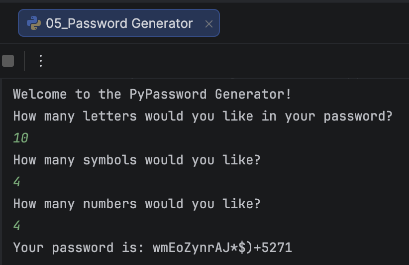

# 🔐 Password Generator


A simple command-line **Password Generator** built with Python.

The user chooses how many **letters**, **symbols**, and **numbers** should be included in the password. The program then generates a random password based on these preferences.

---

## Screenshot

<p align="center">
  
</p>

---

## Features

- 🔐 Random password generation
- 🔤 Custom number of letters
- 🔢 Custom number of digits
- ✨ Custom number of symbols
- 🎲 Uses Python's built-in `random` module
- 🖥 Simple command-line interface

---

## Flowchart

```text
                    Start
                      │
                      ▼
        Ask for Number of Letters
                      │
                      ▼
        Ask for Number of Symbols
                      │
                      ▼
        Ask for Number of Numbers
                      │
                      ▼
     Generate Random Characters
                      │
                      ▼
      Combine into Password List
                      │
                      ▼
        Shuffle Characters*
                      │
                      ▼
          Display Password
                      │
                      ▼
                     End
```

> *The current version of the code contains the shuffle step, but it is commented out. Uncommenting `random.shuffle(password_list)` will fully randomize the password. :contentReference[oaicite:1]{index=1}

---

## Project Structure

```text
Password-Generator/
│
├── 05_Password Generator.py
├── pw_generator.png
└── README.md
```

---

## How to Run

Run the Python file:

```bash
python "05_Password Generator.py"
```

---

## Example

```text
Welcome to the PyPassword Generator!

How many letters would you like?
10

How many symbols would you like?
4

How many numbers would you like?
4

Your password is:

wmEoZynrAJ*$)+5271
```

---

## Concepts Practised

- Variables
- Lists
- Loops (`for`)
- User input
- String concatenation
- Random module
- `random.choice()`
- `random.shuffle()`
- List manipulation
- Password generation

---

## Further Reading

### Python Random Module

https://docs.python.org/3/library/random.html

### Python Lists

https://docs.python.org/3/tutorial/introduction.html#lists

### Python Loops

https://docs.python.org/3/tutorial/controlflow.html#for-statements

### Python String Methods

https://docs.python.org/3/library/stdtypes.html#string-methods

---

## Future Improvements

Possible enhancements:

- Enable full password randomisation using `random.shuffle()`
- Add minimum password strength requirements
- Validate user input
- Allow password length instead of separate character types
- Copy the generated password to the clipboard
- Save generated passwords to a file
- Build a graphical version with Tkinter
