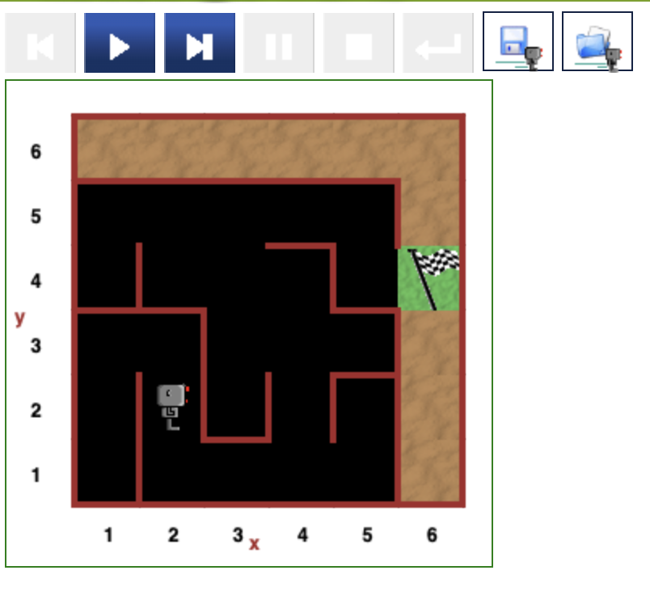
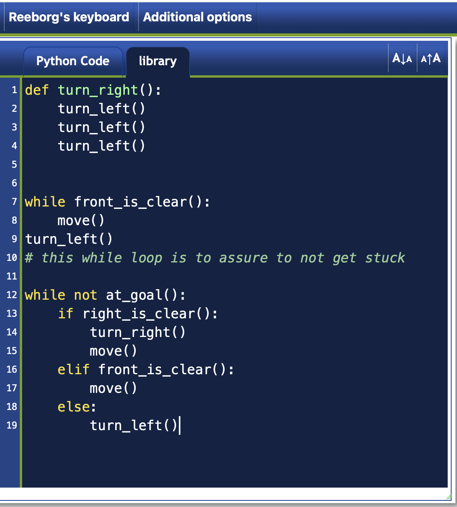

# 🤖 Reeborg's Maze Solver


A Python solution for the **Maze** challenge in **Reeborg's World**.

The robot must navigate through an unknown maze using the **right-hand rule**, following the wall on its right until it reaches the goal.

---

## Screenshots

### Maze

<p align="center">
  
</p>

### Solution

<p align="center">
  
</p>

---

## Features

- 🤖 Autonomous maze navigation
- ↪️ Implements the right-hand rule
- 🔁 Uses loops and conditionals
- 🧠 Creates a reusable `turn_right()` function
- 🏁 Finds the exit automatically

---

## Algorithm

The robot follows a simple strategy:

1. If the path on the **right** is clear → turn right and move.
2. Otherwise, if the path ahead is clear → move forward.
3. Otherwise → turn left.
4. Repeat until the goal is reached.

---

## Flowchart

```text
                 Start
                   │
                   ▼
        Create turn_right()
                   │
                   ▼
      Move to Maze Entrance
                   │
                   ▼
        While Goal Not Reached
                   │
                   ▼
          Right Path Clear?
           ┌───────┴────────┐
          Yes               No
           │                 │
           ▼                 ▼
   Turn Right & Move   Front Clear?
                           │
                   ┌───────┴────────┐
                  Yes               No
                   │                 │
                   ▼                 ▼
                Move           Turn Left
                   │
                   ▼
              Repeat Loop
                   │
                   ▼
                 Goal
```

---

## Project Structure

```text
Reeborg-Maze-Solver/
│
├── Functions_and_Karel_Reborg_game.py
├── reeborgs_maze.png
├── code_reeborg.png
└── README.md
```

---

## How to Run

Open the Reeborg's World website:

https://reeborg.ca/reeborg.html

Load the **Maze** world and paste the Python code into the editor.

Run the program to watch the robot solve the maze automatically.

---

## Concepts Practised

- Functions
- While loops
- if / elif / else
- Boolean conditions
- Custom functions
- Algorithmic thinking
- Maze-solving algorithms
- Code reuse
- Problem decomposition

---

## Further Reading

### Reeborg's World

https://reeborg.ca/

### Python Functions

https://docs.python.org/3/tutorial/controlflow.html#defining-functions

### Python While Loops

https://docs.python.org/3/reference/compound_stmts.html#the-while-statement

### Python if Statements

https://docs.python.org/3/tutorial/controlflow.html#if-statements

---

## Future Improvements

Possible enhancements:

- Solve different maze layouts
- Implement the left-hand rule
- Shortest-path algorithm (Breadth-First Search)
- Depth-First Search (DFS)
- A* pathfinding algorithm
- Visualize the explored path

---

