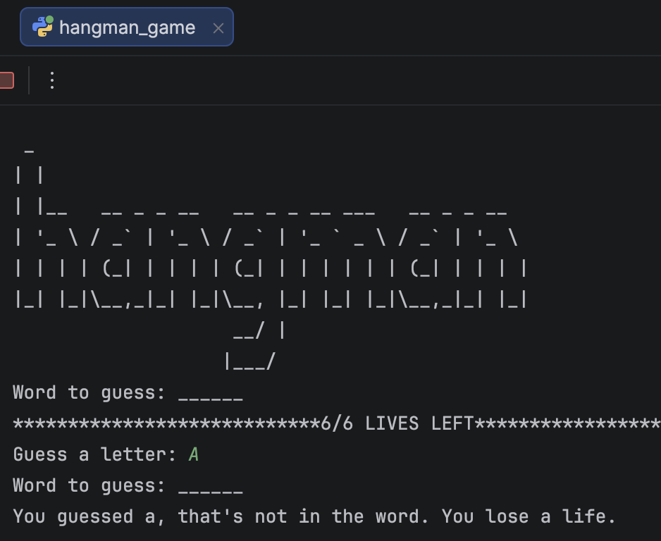
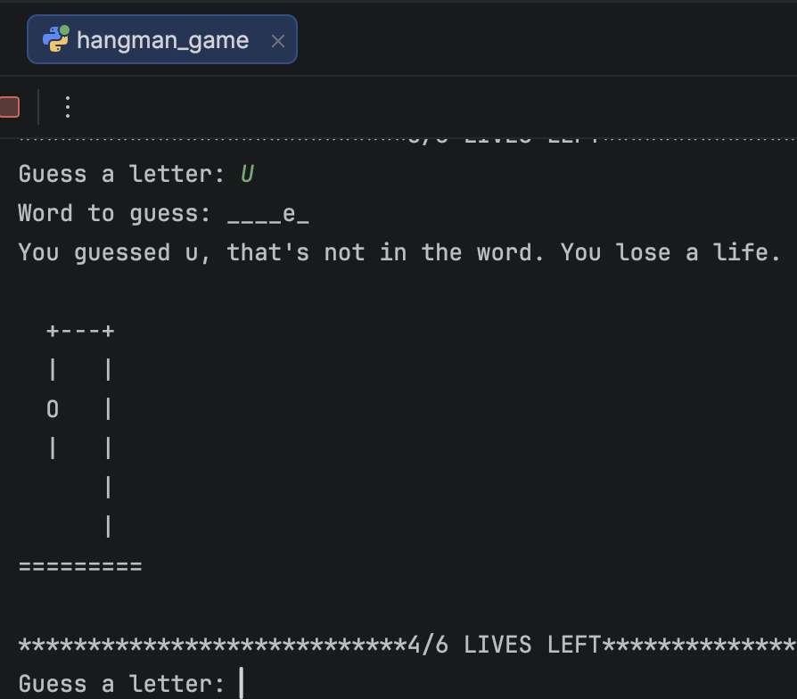
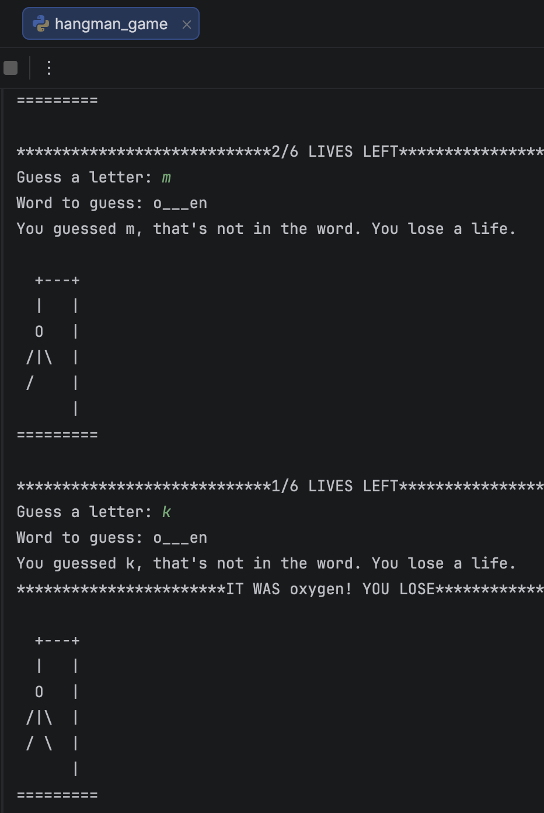
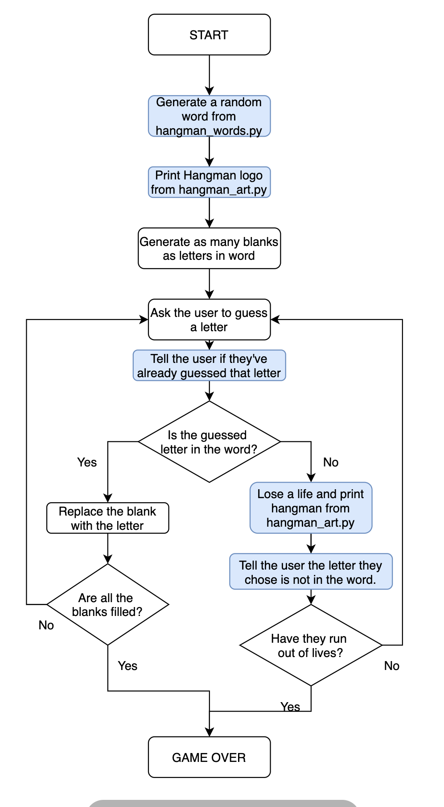

# 🎮 Hangman Game


A classic **Hangman game** built with Python.

The program selects a random word, asks the player to guess one letter at a time, and displays the current word progress and Hangman stage. The player wins by revealing the complete word before all lives are lost.

---

## Screenshots

### Start of the game

<p align="center">
  
</p>

### Game in progress

<p align="center">
  
</p>

### Game over

<p align="center">
  
</p>

---

## Flowchart

<p align="center">
  
</p>

---

## Features

- Random word selection
- Letter-by-letter guessing
- ASCII art Hangman stages
- Remaining-lives display
- Feedback for incorrect guesses
- Win and loss conditions
- Simple command-line interface

---

## Project Structure

```text
Hangman-Game/
│
├── hangman_game.py
├── hangman_words.py
├── hangman_art.py
├── hangman_flowchart.png
├── h_man1.png
├── h_man2.png
├── h_man5png.png
└── README.md
```

---

## How to Run

Run the main Python file:

```bash
python hangman_game.py
```

No external packages are required.

---

## How to Play

1. Start the program.
2. Enter one letter when prompted.
3. Correct letters appear in their positions in the hidden word.
4. Incorrect guesses reduce the number of remaining lives.
5. Reveal the full word before the Hangman drawing is completed.

---

## Concepts Practised

- Variables
- Lists
- Loops
- Conditional statements
- User input
- String manipulation
- Membership checks
- Random word selection
- Importing data from separate Python files
- Game state management
- ASCII art

---

## Future Improvements

- Prevent repeated guesses from reducing lives
- Validate non-letter input
- Add difficulty levels
- Add categories for the word list
- Track wins and losses
- Add a replay option
- Build a graphical version with Tkinter
