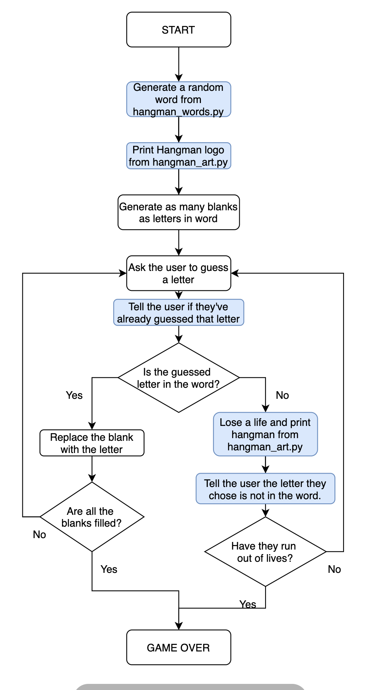

# Hangman Game

This is a mini **Hangman** game created with Python.

## Flowchart

<p align="center">
  
</p>

## Features

- Random word selection
- ASCII art hangman
- Tracks guessed letters
- Win/lose conditions
- Beginner-friendly Python project

## Project Structure

```text
.
├── hangman_art.py
├── hangman_flowchart.png
├── hangman_game.py
├── hangman_words.py
└── README.md
```

## How to Run

```bash
python hangman_game.py
```
