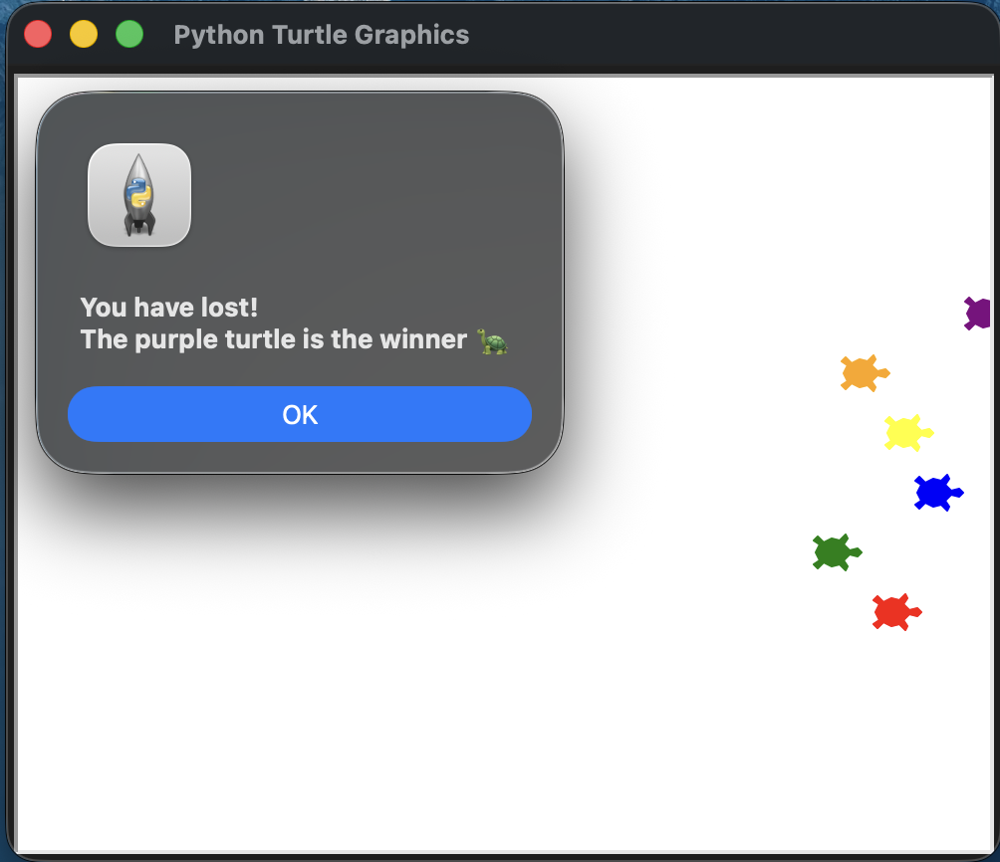

# 🐢 Turtle Race

This project is a fun racing game built with Python's **Turtle Graphics** module.

The player places a bet on which turtle will win the race before it begins. Six turtles race across the screen, each moving a random distance until one reaches the finish line. At the end of the race, a pop-up message announces whether the player's prediction was correct.

---

## Screenshot

<p align="center">
  
</p>

---

## Flowchart

```text
                     Start
                       │
                       ▼
              Ask Player for Bet
                       │
                       ▼
             Create Six Turtles
                       │
                       ▼
                 Start Race
                       │
                       ▼
            Move Turtles Randomly
                       │
              Winner Reached?
                 ┌─────┴─────┐
                 │           │
                No          Yes
                 │           │
                 ▼           ▼
           Continue Race  Compare Bet
                               │
                               ▼
                    Display Result Popup
                               │
                               ▼
                              End
```

---

## Features

- Choose a turtle before the race starts
- Six colorful racing turtles
- Random movement simulation
- Winner detection
- Interactive message box displaying the result
- Beginner-friendly Turtle Graphics project

---

## Screenshot

<p align="center">
  
</p>

---

## Project Structure

```text
.
├── turtle_race.py
├── turtle_race_demo.png
└── README.md
```

---

## How to Run

```bash
python turtle_race.py
```

---

## Example

```text
Make your bet!

Which turtle will win the race?

red
green
blue
yellow
orange
purple
```

After the race finishes:

```
You win!

The green turtle is the winner 🐢
```

or

```
You have lost!

The purple turtle is the winner 🐢
```

---

## Concepts Practiced

- Turtle Graphics
- Object-Oriented Programming
- Lists
- Loops
- Random module
- Event handling
- User input
- GUI pop-up messages (`tkinter.messagebox`)
- Animation
- Simulation

---

## Further Reading

### Turtle Graphics

https://docs.python.org/3/library/turtle.html

### Python Random Module

https://docs.python.org/3/library/random.html

### Tkinter Message Box

https://docs.python.org/3/library/tkinter.messagebox.html

### Turtle Shapes

https://docs.python.org/3/library/turtle.html#turtle.shape
