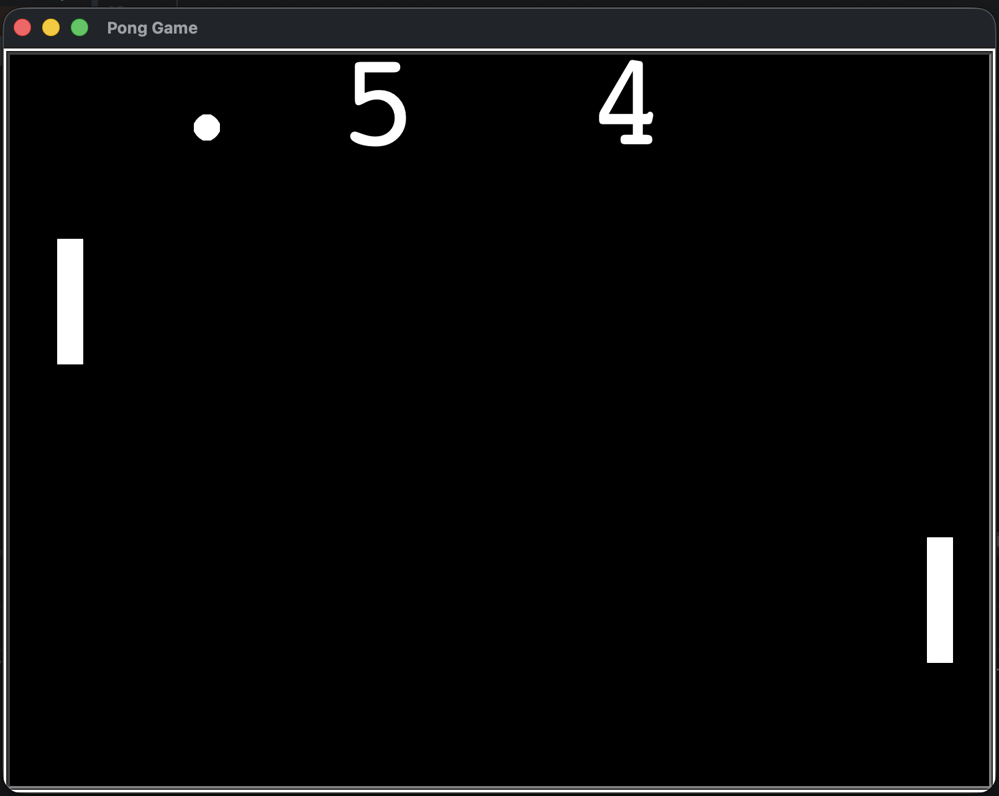

# 🏓 Pong Game


A two-player **Pong Game** created with Python using the built-in **Turtle Graphics** module.

Two players control paddles on opposite sides of the screen and try to prevent the ball from passing them. When a player misses the ball, the opponent receives a point and the ball returns to the center.

---

## Screenshot

<p align="center">
  
</p>

---

## Features

- Two-player gameplay
- Keyboard-controlled paddles
- Ball movement and animation
- Ball collision with the upper and lower walls
- Paddle collision detection
- Automatic score tracking
- Ball speed increases after paddle collisions
- Ball resets after a player scores
- Object-Oriented project structure

---

## Controls

| Player | Key | Action |
|---|---|---|
| Left player | `W` | Move paddle up |
| Left player | `S` | Move paddle down |
| Right player | `↑` | Move paddle up |
| Right player | `↓` | Move paddle down |

---

## Game Flow

```text
                       Start
                         │
                         ▼
               Create Game Screen
                         │
                         ▼
          Create Paddles, Ball and Scoreboard
                         │
                         ▼
                 Listen for Keys
                         │
                         ▼
                  Start Game Loop
                         │
                         ▼
                    Move Ball
                         │
          ┌──────────────┼───────────────┐
          │              │               │
          ▼              ▼               ▼
   Wall Collision?  Paddle Collision?  Paddle Miss?
          │              │               │
         Yes            Yes             Yes
          │              │               │
          ▼              ▼               ▼
    Bounce Ball     Bounce Ball      Add Point
    Vertically      Horizontally     Reset Ball
          │              │               │
          └──────────────┴───────────────┘
                         │
                         ▼
                  Continue Game
```

---

## Project Structure

```text
Pong-Game/
│
├── main.py
├── ball.py
├── paddle.py
├── scoreboard.py
├── README.md
└── images/
    └── pong_game.png
```

---

## Class Responsibilities

### `Ball`

The `Ball` class controls:

- Ball appearance
- Ball movement
- Horizontal and vertical bouncing
- Ball speed
- Resetting the ball after a point

### `Paddle`

The `Paddle` class controls:

- Paddle appearance
- Starting position
- Upward movement
- Downward movement

Two objects are created from this class: one for each player.

### `Scoreboard`

The `Scoreboard` class controls:

- Left player's score
- Right player's score
- Score display
- Score updates after each point

### `main.py`

The main program controls:

- Screen setup
- Object creation
- Keyboard events
- Main game loop
- Collision detection
- Point allocation
- Screen updates

---

## Object-Oriented Design

```text
                     main.py
                        │
          ┌─────────────┼─────────────┐
          │             │             │
          ▼             ▼             ▼
        Ball         Paddle       Scoreboard
                         │
                  ┌──────┴──────┐
                  │             │
                  ▼             ▼
            Left Paddle   Right Paddle
```

---

## How to Run

Clone the repository:

```bash
git clone https://github.com/yourusername/pong-game.git
```

Open the project folder:

```bash
cd pong-game
```

Run the main Python file:

```bash
python main.py
```

No external packages are required because the project uses Python's built-in `turtle` and `time` modules.

---

## How to Play

1. Start the program.
2. The left player uses `W` and `S`.
3. The right player uses the up and down arrow keys.
4. Keep the ball from passing your paddle.
5. When a player misses the ball, the opponent receives one point.
6. Continue playing and try to achieve the highest score.

---

## Concepts Practiced

- Object-Oriented Programming
- Classes and objects
- Class inheritance
- Constructors with `__init__`
- Methods and attributes
- Object composition
- Turtle Graphics
- Keyboard event listeners
- Game loops
- Collision detection
- Coordinate systems
- Animation
- Score tracking
- Modular project structure
- Importing classes from separate files
- Program state management

---

## Further Reading

### Python Turtle Graphics

The official Python documentation for Turtle Graphics:

https://docs.python.org/3/library/turtle.html

### Python Classes

https://docs.python.org/3/tutorial/classes.html

### Python Modules

https://docs.python.org/3/tutorial/modules.html

---

## Future Improvements

Possible future additions:

- Add a center dividing line
- Add a winning score
- Display a game-over message
- Add a restart option
- Prevent paddles from leaving the screen
- Add sound effects
- Add a start menu
- Add single-player mode
- Save the highest score

---

## Author

Created as part of my Python learning journey to practise Object-Oriented Programming, event handling, animation, and game development with Turtle Graphics.
