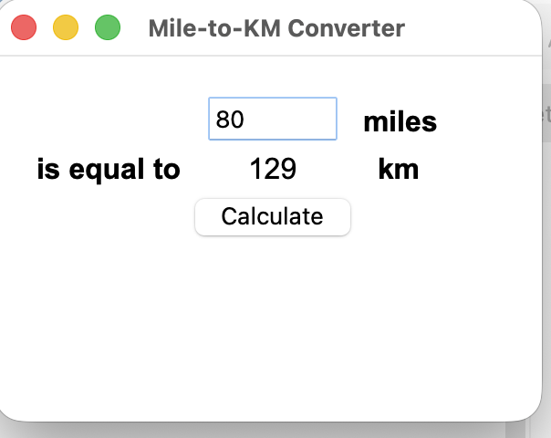

# 🚗 Miles to Kilometres Converter


A simple desktop application built with **Python** and **Tkinter** that converts miles into kilometres.

The user enters a number of miles, clicks the **Calculate** button, and the application displays the converted distance in kilometres.

---

## Screenshot

<p align="center">
  
</p>

---

## Features

- Simple graphical user interface
- Converts miles into kilometres
- Accepts decimal input
- Displays the result instantly
- Uses Python's built-in Tkinter library
- Beginner-friendly project structure

---

## Conversion Formula

```text
kilometres = miles × 1.60934
```

The result is rounded to the nearest whole number.

---

## Project Structure

```text
Miles-to-KM-Converter/
│
├── 27_Mile_to_KM_Converter.py
├── 27_miles_to_km.png
└── README.md
```

---

## How to Run

Run the Python file:

```bash
python 27_Mile_to_KM_Converter.py
```

No external packages are required because Tkinter is included with most Python installations.

---

## Example

```text
Input:  80 miles
Output: 129 km
```

---

## Concepts Practised

- Tkinter
- Graphical User Interfaces
- Windows
- Labels
- Entry fields
- Buttons
- Grid layout
- Functions
- Event handling
- Type conversion
- Updating widget properties
- Mathematical calculations

---

## Further Reading

### Tkinter Documentation

https://docs.python.org/3/library/tkinter.html

### Python Functions

https://docs.python.org/3/tutorial/controlflow.html#defining-functions
