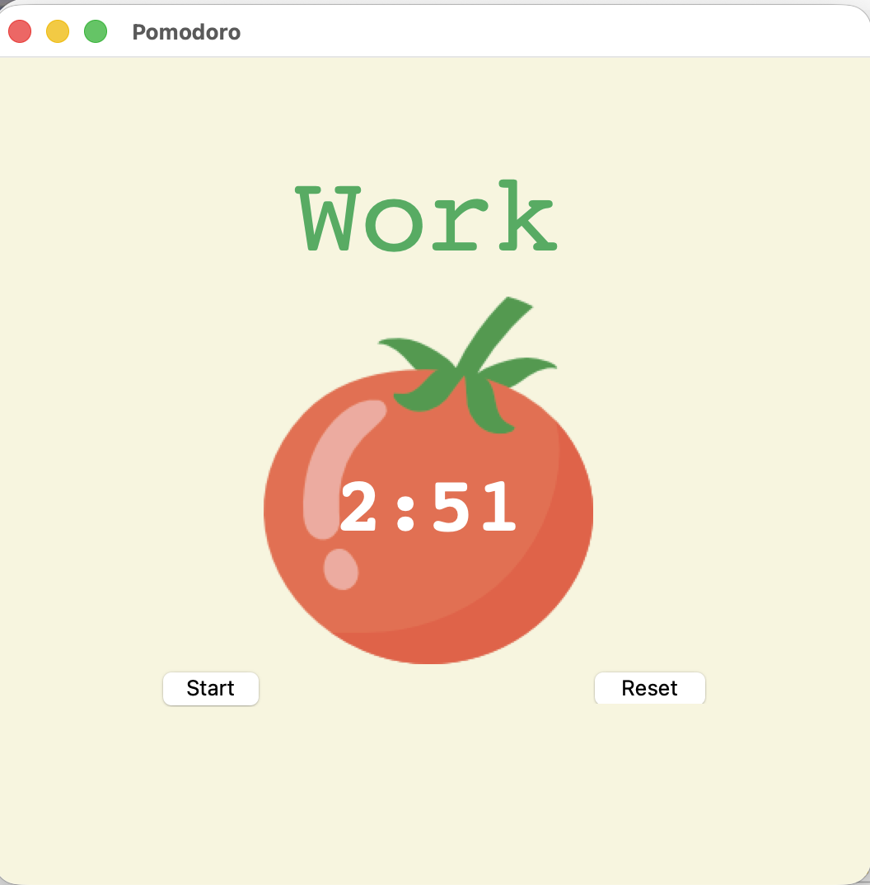
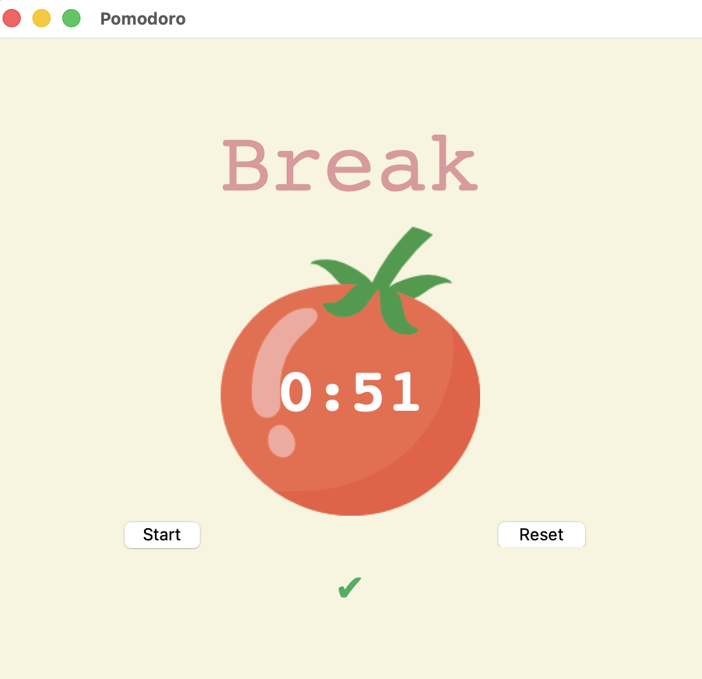
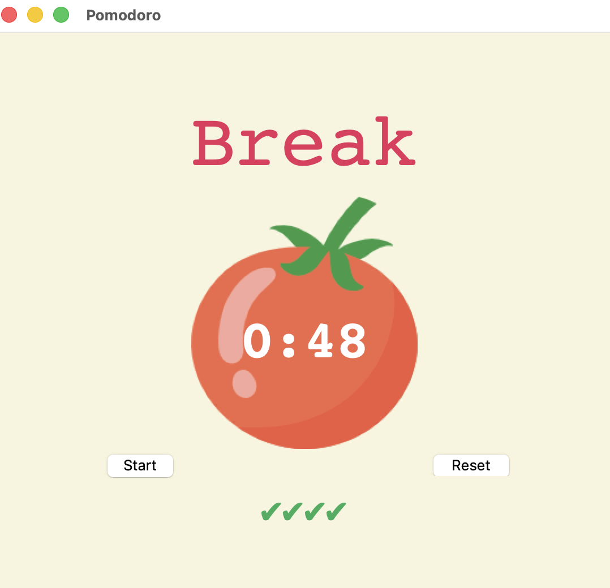

# 🍅 Pomodoro Timer


A graphical **Pomodoro Timer** built with **Python** and **Tkinter**.

The application follows the Pomodoro productivity technique by alternating between focused work sessions, short breaks, and long breaks while displaying a countdown timer and tracking completed work sessions.

---

# 📸 Screenshots

## 🍅 Work Session

<p align="center">
  
</p>

---

## ☕ Short Break

<p align="center">
  
</p>

---

## 🌴 Long Break

<p align="center">
  
</p>

---

# 🚀 Features

- ⏱ Countdown timer
- 🍅 Work sessions
- ☕ Short breaks
- 🌴 Long breaks
- ✔ Visual progress tracker
- 🔄 Reset timer
- 🎨 Tkinter graphical user interface
- 🖼 Custom tomato image

---

# 🛠 Technologies Used

- Python 3
- Tkinter
- Canvas
- Labels
- Buttons
- `window.after()` scheduling
- Math module

---

# 📂 Project Structure

```text
Pomodoro-Timer/
│
├── main.py
├── tomato.png
├── work.png
├── small_break.png
├── break_img.png
└── README.md
```

---

# 💡 Concepts Practiced

Throughout this project I practiced:

- Tkinter GUI development
- Event-driven programming
- Countdown timers
- State management
- Functions
- Global variables
- Canvas widgets
- Labels & Buttons
- Recursion with `after()`
- Modular code organization

---

# ▶️ How to Run

Clone the repository:

```bash
git clone https://github.com/yourusername/python-mini-projects.git
```

Navigate to the project folder:

```bash
cd Pomodoro-Timer
```

Run the application:

```bash
python main.py
```

---

# 📖 Learning Resources

### Tkinter Documentation

https://docs.python.org/3/library/tkinter.html

### Tkinter Canvas

https://docs.python.org/3/library/tkinter.html#the-canvas-widget

### Python Documentation

https://docs.python.org/3/

---

# 🎯 Python components


Key outcomes included:

- Building responsive GUI applications
- Updating interface elements dynamically
- Scheduling events with `window.after()`
- Managing application state
- Separating business logic from the user interface
- Creating interactive productivity tools

---

⭐ Thank you for checking out this project!
