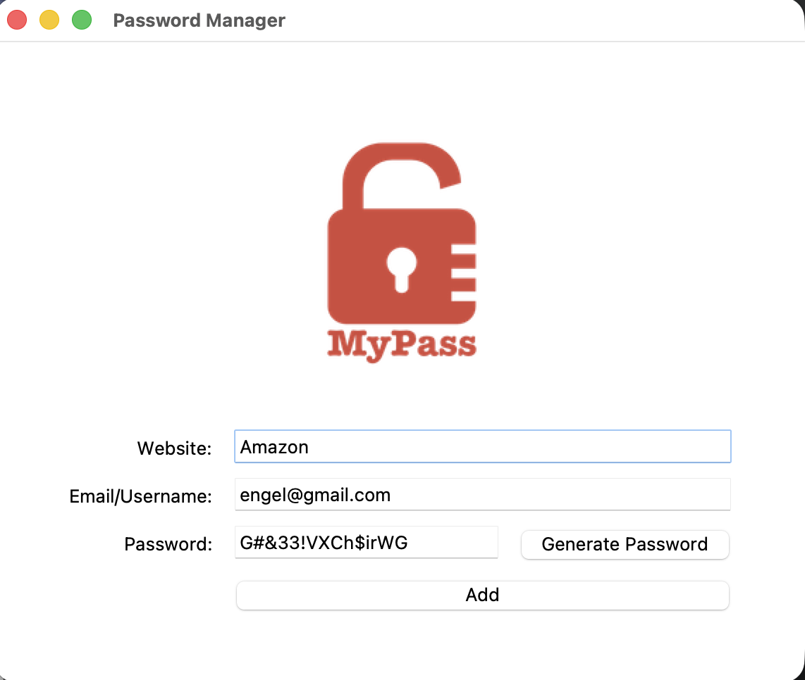
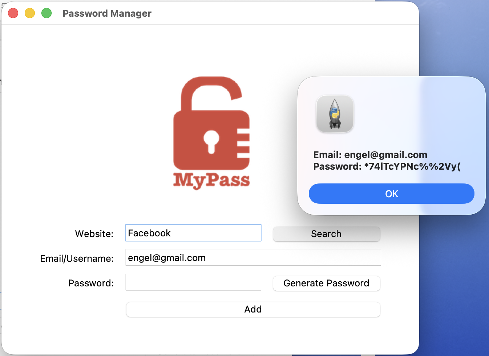
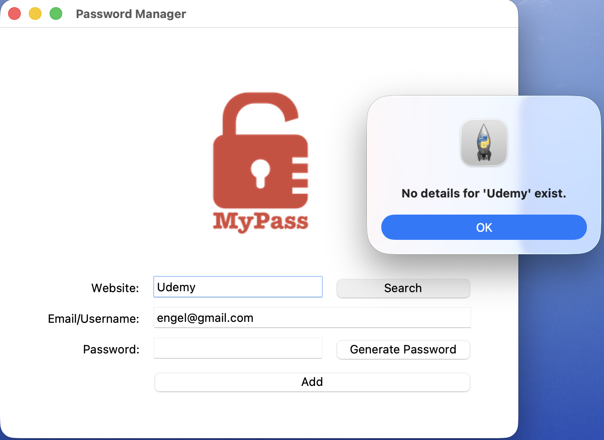
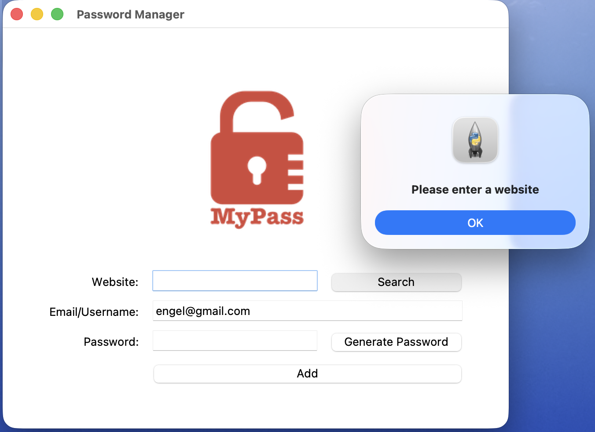

# 🔐 MyPass - Password Manager


**MyPass** is a desktop password manager built with **Python** and **Tkinter**.

The application allows users to generate secure passwords, store login credentials in a JSON database, search for existing accounts, and automatically copy generated passwords to the clipboard.

---

# 📸 Screenshots

## 🏠 Main Application

<p align="center">
    
</p>

---

## 🔍 Search Existing Credentials

<p align="center">
    
</p>

---

## ⚠ Website Not Found

<p align="center">
    
</p>

---

## ⚠ Missing Website Input

<p align="center">
    
</p>

---

# 🚀 Features

- 🔐 Secure random password generator
- 🎲 Random letters, symbols and numbers
- 📋 Automatic clipboard copy
- 💾 Store passwords in a JSON database
- 🔍 Search passwords by website
- ⚠ Input validation
- 🛡 Handles missing files gracefully
- ❌ Detects unknown websites
- 🖥 Clean Tkinter graphical interface
- 📁 Persistent local storage

---

# 🛠 Technologies Used

- Python 3
- Tkinter
- JSON
- Pyperclip
- Random
- MessageBox dialogs

---

# 📂 Project Structure

```text
MyPass/
│
├── main.py
├── data.json
├── logo.png
├── pw_generator.png
├── website_found.png
├── website_notfound.png
├── enter_websitename.png
└── README.md
```

---

# 💡 Concepts Practiced

Throughout this project I practiced:

- Tkinter GUI development
- Event-driven programming
- JSON file handling
- Reading & writing structured data
- Exception handling
- Clipboard integration
- Password generation
- Input validation
- Dictionary manipulation
- User-friendly dialog boxes
- Grid layout management

---

# ▶️ How to Run

Clone the repository:

```bash
git clone https://github.com/yourusername/python-mini-projects.git
```

Navigate into the project:

```bash
cd MyPass
```

Install the required dependency:

```bash
pip install pyperclip
```

Run the application:

```bash
python main.py
```

---

# 📖 Learning Resources

### Tkinter

https://docs.python.org/3/library/tkinter.html

### TkDocs

https://tkdocs.com/

### JSON

https://docs.python.org/3/library/json.html

### Pyperclip

https://pypi.org/project/pyperclip/

---

# 🎯 Key outcomes

This project introduced several concepts commonly used in desktop applications and real-world software development.

Key outcomes included:

- Building graphical desktop applications with Tkinter
- Designing reusable functions
- Creating secure random passwords
- Reading and writing JSON files
- Exception handling using `try`, `except`, `else`, and `finally`
- Searching data efficiently with dictionaries
- Validating user input
- Working with external Python packages
- Creating responsive user interfaces

---

# 🚀 Future Improvements

Possible enhancements include:

- 🔒 Encrypt stored passwords
- 👁 Show / Hide password
- 🗑 Edit and delete credentials
- 🔑 Master password authentication
- ☁ Cloud synchronization
- 🌙 Dark mode
- 🔐 Password strength indicator
- 📂 Export / Import password database

---

⭐ Thank you for checking out this project!
