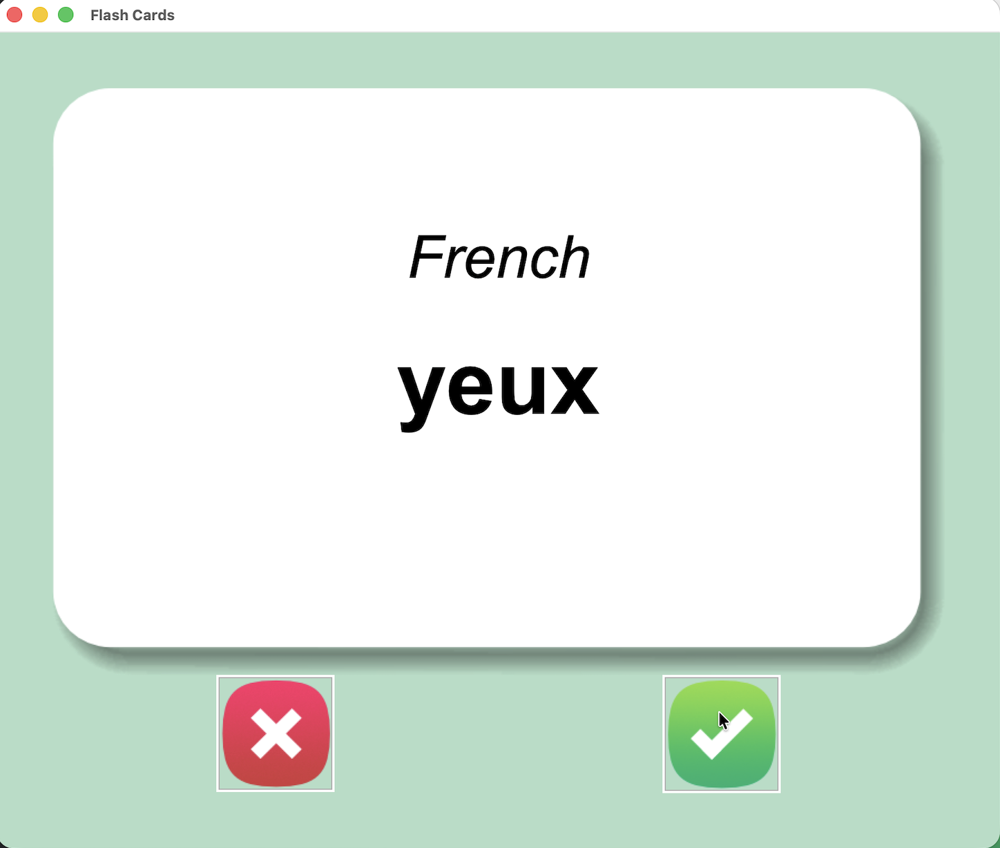
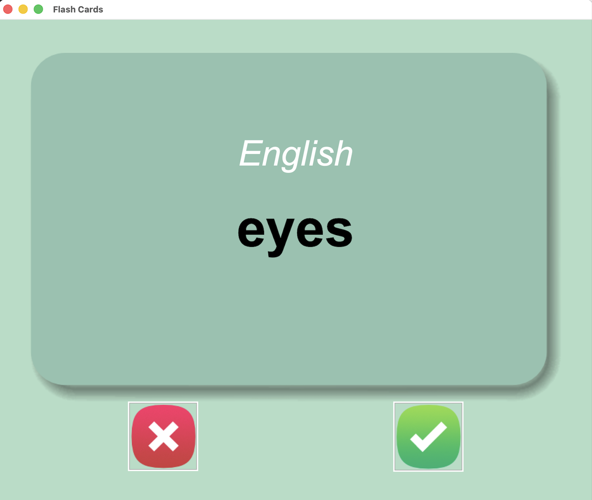

# 🇫🇷 French Flash Cards


A desktop flash card application built with **Python**, **Tkinter**, and **Pandas** to help learn the most common French vocabulary.

The application automatically flips each flash card after a few seconds, tracks learning progress, and removes words you've already mastered.

---

# 📸 Screenshots

## 🇫🇷 French Flash Card

<p align="center">
    
</p>

---

## 🇬🇧 English Translation

<p align="center">
    
</p>

---

# 🚀 Features

- 🇫🇷 Learn the 1000+ most common French words
- 🔄 Automatic card flip after 3 seconds
- 🎲 Random vocabulary selection
- ✅ Mark words as learned
- 💾 Saves learning progress automatically
- 📂 Loads previous progress when restarting
- 📊 CSV-based vocabulary database
- 🖥 Interactive desktop GUI built with Tkinter

---

# 🛠 Technologies Used

- Python 3
- Tkinter
- Pandas
- CSV
- Random

---

# 📂 Project Structure

```text
Flash_Cards/
│
├── main.py
├── data/
│   ├── french_words.csv
│   └── words_to_learn.csv
│
├── images/
│   ├── card_front.png
│   ├── card_back.png
│   ├── right.png
│   └── wrong.png
│
├── yeux.png
├── eyes.png
└── README.md
```

---

# ⚙️ How It Works

1. The application loads the French vocabulary list.
2. A random French word is displayed.
3. After **3 seconds**, the flash card flips automatically.
4. The English translation is revealed.
5. Press:

- ✅ **Right** if you knew the word.
- ❌ **Wrong** if you want to study it again.

Known words are automatically removed from the learning list and saved for future sessions.

---

# 💡 Concepts Practiced

During this project I learned:

- Building desktop applications with Tkinter
- Working with Pandas DataFrames
- Reading and writing CSV files
- Event-driven programming
- Using timers with `after()`
- Canceling scheduled events with `after_cancel()`
- Random data selection
- Persistent user progress
- Dictionary & list manipulation
- Canvas widgets and images
- Exception handling (`try` / `except`)

---

# ▶️ How to Run

Clone the repository:

```bash
git clone https://github.com/yourusername/python-mini-projects.git
```

Navigate to the project:

```bash
cd Flash_Cards
```

Install the required package:

```bash
pip install pandas
```

Run the application:

```bash
python main.py
```

---

# 📚 Learning Resources

The following resources were used during development:

### Translation Resources

- https://github.com/hermitdave/FrequencyWords
- https://en.wiktionary.org/wiki/Wiktionary:Frequency_lists
- https://support.google.com/docs/answer/3093331
- https://docs.cloud.google.com/translate/docs/languages
- https://www.opensubtitles.org

### Pandas

https://pandas.pydata.org/pandas-docs/stable/

### Tkinter

https://docs.python.org/3/library/tkinter.html

### TkDocs

https://tkdocs.com/

---

# 🎯 Key takeaways

This project is combining a graphical user interface with persistent data storage.

Key takeaways included:

- Building interactive desktop applications
- Managing state across sessions
- Working with datasets using Pandas
- Reading and updating CSV files
- Scheduling events with timers
- Designing a simple spaced-repetition learning workflow

---

# 🚀 Future Improvements

Possible enhancements include:

- 🔊 Audio pronunciation
- 🇩🇪 Additional language support
- ⭐ Difficulty levels
- 📈 Learning statistics dashboard
- 📝 Custom vocabulary lists
- 🌙 Dark mode
- ☁ Cloud synchronization
- 🔍 Search vocabulary
- 📱 Responsive layout

---

⭐ Thank you for checking out this project!
