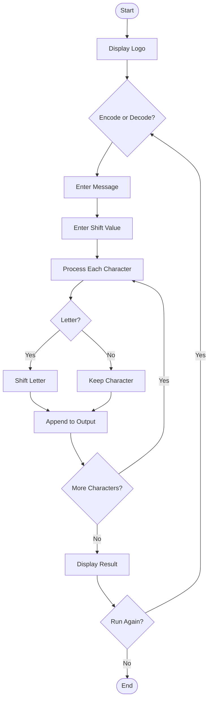
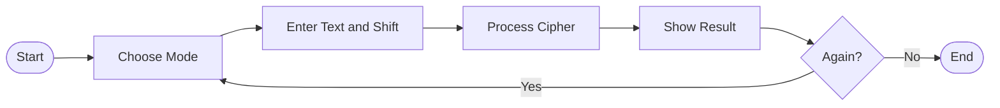
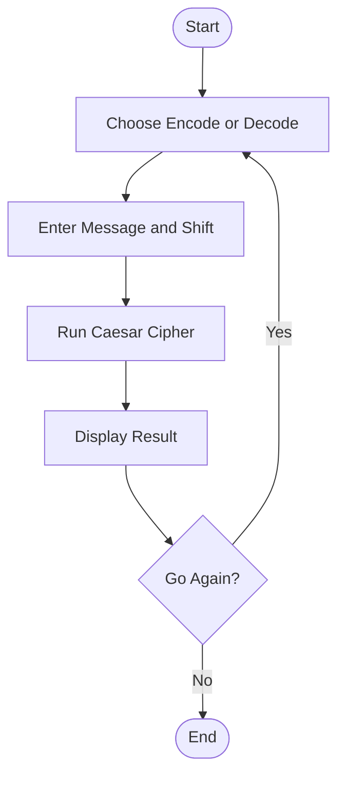
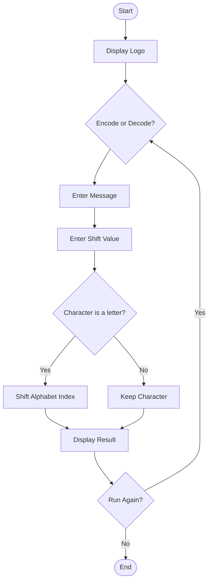

# Caesar Cipher Encoder

This is a simple **Caesar Cipher** encoder and decoder written in Python.

The program encrypts or decrypts messages by shifting each letter of the alphabet by a user-defined number of positions. It also preserves spaces, numbers, and punctuation.


## Flowchart




## Flowchart




## Flowchart



## Flowchart




               Start
                 │
                 ▼
          Display Logo
                 │
                 ▼
      Encode or Decode?
                 │
                 ▼
         Enter Message
                 │
                 ▼
       Enter Shift Value
                 │
                 ▼
        Character a letter?
            ┌────┴────┐
          Yes         No
           │           │
           ▼           ▼
 Shift Alphabet   Keep Character
      Index            │
           └────┬──────┘
                ▼
        Display Result
                │
                ▼
          Run Again?
            ┌───┴───┐
          Yes      No
           │        │
           ▼        ▼
        Repeat     End


        

## Features

- Encode text using the Caesar Cipher
- Decode encrypted messages
- Supports any shift value
- Preserves spaces, numbers, and symbols
- Continuous program loop until the user exits

## Project Structure

```text
.
├── art.py
├── Ceaser Cipher_Encoder.py
├── caesar_cipher_flowchart.png
└── README.md
```

## How to Run

```bash
python "Ceaser Cipher_Encoder.py"
```

## Example

```
Type 'encode' to encrypt, type 'decode' to decrypt:
encode

Type your message:
hello world

Type the shift number:
5

Here is the encoded result:
mjqqt btwqi
```

## Concepts Practiced

- Functions
- Loops
- Lists
- Conditional statements
- String manipulation
- Modulo operator (`%`)
- User input and program flow
